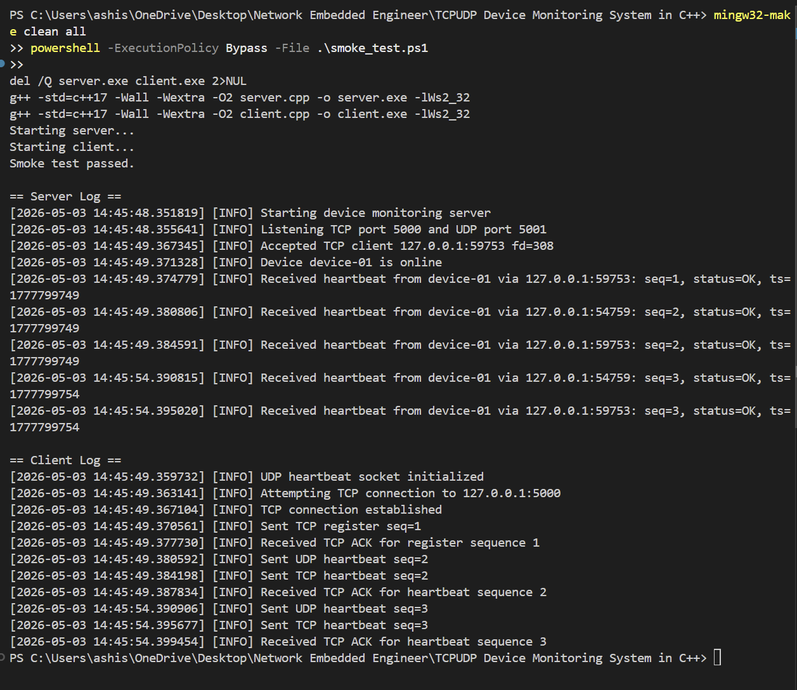

# TCP/UDP Device Monitoring System

A compact C++ monitoring system for embedded Linux devices. Each client sends UDP heartbeats and maintains a TCP session for registration and ACK-checked liveness.

## Files

- `client.cpp`: device client with UDP heartbeat transmission, TCP registration, ACK handling, and reconnect logic
- `server.cpp`: monitoring server that accepts TCP clients, listens for UDP heartbeats, tracks device state, and detects timeouts
- `common.h`: shared packet definitions, protocol constants, socket helpers, and logging utilities
- `Makefile`: build targets for `server` and `client`
- `run.sh`: optional Linux helper to launch one server and a few sample clients
- `smoke_test.ps1`: automated Windows smoke test that launches the server and one client, then validates expected log lines

## Features

- fixed packet structure shared by client and server
- heartbeat messages over both UDP and TCP
- TCP register handshake with ACK validation
- reconnect logic when the TCP session drops or ACKs stop arriving
- timeout detection for offline devices
- timestamped logging on both client and server

## Packet Format

All messages use the same fixed-size `HeartbeatPacket`:

```text
PacketHeader
  version   : uint8_t
  type      : uint8_t   (Register, Heartbeat, Ack)
  magic     : uint16_t

HeartbeatPacket
  header    : PacketHeader
  sequence  : uint32_t
  timestamp : uint64_t
  deviceId  : 16-byte char array
  status    : uint8_t   (Ok, Warning, Error)
  padding   : 7 bytes
```

Notes:

- `Register` is sent once whenever the client establishes a TCP connection.
- `Heartbeat` is sent periodically over UDP and, when connected, over TCP.
- `Ack` is sent by the server for each valid TCP register or heartbeat packet.
- Multi-byte numeric fields are transmitted in network byte order.

## Build

```sh
make
```

Clean generated binaries:

```sh
make clean
```

On Windows with MinGW:

```powershell
mingw32-make clean all
```

## Run

Start the server:

```sh
./server
```

Start a client:

```sh
./client device-01
```

Use a remote server IP or hostname:

```sh
./client device-02 192.168.1.100
```

## Automated Smoke Test

After building on Windows, run:

```powershell
.\smoke_test.ps1
```

The script:

- starts `server.exe`
- starts `client.exe device-01 127.0.0.1`
- waits for register and heartbeat activity
- checks the logs for expected TCP ACK and heartbeat lines
- exits with an error if any expected log line is missing

## Result

The screenshot below shows the monitoring system running successfully, with the server accepting the client and the client exchanging register, heartbeat, and ACK messages:



## Runtime Behavior

- The client sends a UDP heartbeat every `HEARTBEAT_INTERVAL_SEC`.
- The client attempts to keep a TCP connection to port `5000`.
- After a TCP reconnect, the client sends a register packet and waits for an ACK.
- Every TCP heartbeat also requires an ACK. If the ACK is missing or invalid, the client closes the TCP session and reconnects on the next cycle.
- The server marks a device offline if no heartbeat arrives for `DEVICE_TIMEOUT_SEC`.
- TCP connection state is tracked separately from overall device online state, so a device can stay online via UDP while TCP is reconnecting.

## Example Output

Server startup:

```text
[2026-05-03 12:00:00.000000] [INFO] Starting device monitoring server
[2026-05-03 12:00:00.000000] [INFO] Listening TCP port 5000 and UDP port 5001
```

Client:

```text
[2026-05-03 12:00:05.000000] [INFO] Sent TCP register seq=1
[2026-05-03 12:00:05.000000] [INFO] Received TCP ACK for register sequence 1
[2026-05-03 12:00:10.000000] [INFO] Sent UDP heartbeat seq=2
[2026-05-03 12:00:10.000000] [INFO] Sent TCP heartbeat seq=2
[2026-05-03 12:00:10.000000] [INFO] Received TCP ACK for heartbeat sequence 2
```

Server summary:

```text
-- Device Summary --
device-01 | last=127.0.0.1:51024 | seq=8 | status=OK | age=1s | online=yes | tcp=yes
---------------------
```

## Embedded Linux Notes

- Default ports are `5000/TCP` and `5001/UDP`.
- The code uses BSD sockets and builds with `g++` and C++17.
- If devices and server run on different machines, allow both ports through the firewall.
